# Rapport de projet — CSC8607 : Introduction au Deep Learning

> **Consignes générales**
> - Tenez-vous au **format** et à l’**ordre** des sections ci-dessous.
> - Intégrez des **captures d’écran TensorBoard** lisibles (loss, métriques, LR finder, comparaisons).
> - Les chemins et noms de fichiers **doivent** correspondre à la structure du dépôt modèle (ex. `runs/`, `artifacts/best.ckpt`, `configs/config.yaml`).
> - Répondez aux questions **numérotées** (D1–D11, M0–M9, etc.) directement dans les sections prévues.

---

## 0) Informations générales

- **Étudiant·e** : HADDAOU Hanna
- **Projet** : Projet 15, ESC-50 (50 classes) avec CNN 2D sur spectrogrammes log-mel
- **Dépôt Git** : https://github.com/hannahadd/csc8607_projects
- **Environnement** : python -c "import torch, torchaudio; print('torch', torch.__version__); print('torchaudio', torchaudio.__version__)"
- **Commandes utilisées** :
  - Entraînement : python -m src.train --config configs/config.yaml
  - LR finder : python -m src.lr_finder --config configs/config.yaml
  - Grid search : python -m src.grid_search --config configs/config.yaml
  - Évaluation : python -m src.evaluate --config configs/config.yaml --checkpoint artifacts/best.ckpt

---

## 1) Données

### 1.1 Description du dataset
- **Source** (lien) :
- **Type d’entrée** (image / texte / audio / séries) : audio (fichiers WAV) transformé en spectrogramme log-mel (traité comme une image)
- **Tâche** (multiclasses, multi-label, régression) : classification multiclasses (50 classes)
- **Dimensions d’entrée attendues** (`meta["input_shape"]`) : (1, 64, T)
- **Nombre de classes** (`meta["num_classes"]`) : 50

**D1.** Quel dataset utilisez-vous ? D’où provient-il et quel est son format (dimensions, type d’entrée) ?

J’utilise le dataset ESC-50, un jeu de données de classification de sons environnementaux contenant 2 000 enregistrements audio de 5 secondes répartis en 50 classes (40 exemples par classe). Les données sont fournies sous forme de fichiers WAV et d’un fichier d’annotations meta/esc50.csv (colonnes notamment : filename, fold, category). Chaque audio est converti en spectrogramme log-mel afin d’être traité par un CNN 2D.

### 1.2 Splits et statistiques

| Split | #Exemples | Particularités (déséquilibre, longueur moyenne, etc.) |
|------:|----------:|--------------------------------------------------------|
| Train |     1200      |                           sons de 5s                             |
| Val   |       400    |                              mêm distribution attendues que train/test                          |
| Test  |        400   |                                   split indépendant via fold 5                     |

**D2.** Donnez la taille de chaque split et le nombre de classes.  
Avec cette stratégie par folds, on obtient 1200 exemples en train, 400 en validation et 400 en test, pour un total de 50 classes. Les entrées sont des spectrogrammes de forme (1, 64, T).

**D3.** Si vous avez créé un split (ex. validation), expliquez **comment** (stratification, ratio, seed).
Je n’ai pas créé de split aléatoire : j’ai utilisé le protocole du dataset via les folds du fichier esc50.csv. Cela garantit une séparation reproductible et standard. (La seed n’intervient donc pas dans la création des splits.)

**D4.** Donnez la **distribution des classes** (graphique ou tableau) et commentez en 2–3 lignes l’impact potentiel sur l’entraînement. 

Le dataset ESC-50 est conçu pour être équilibré (40 exemples par classe sur l’ensemble). Sur le split test (fold 5), la classe majoritaire observée (“pig”) représente 8/400 = 2%, ce qui confirme l’absence de déséquilibre marqué.
L’accuracy est une métrique pertinente ici et il n’est pas nécessaire d’utiliser des pondérations de classes ; le modèle doit dépasser largement ~2% pour démontrer un apprentissage réel.

**D5.** Mentionnez toute particularité détectée (tailles variées, longueurs variables, multi-labels, etc.).
Les enregistrements audio font 5 secondes, mais une fois transformés en spectrogrammes, on obtient une représentation temporelle (axe T) déterminée par les paramètres de STFT/hop. Les labels sont single-label (une classe par exemple). Aucune donnée manquante n’est attendue : chaque ligne du CSV référence un fichier WAV existant.

### 1.3 Prétraitements (preprocessing) — _appliqués à train/val/test_

Listez précisément les opérations et paramètres (valeurs **fixes**) :

Chargement WAV -> conversion mono

- Vision : resize = __, center-crop = __, normalize = (mean=__, std=__)…
- Audio : resample = 16000 Hz, mel-spectrogram (n_mels= 64, n_fft=400 , hop_length=160), Conversion en échelle log avec AmplitudeToDB
- NLP : tokenizer = __, vocab = __, max_length = __, padding/truncation = __…
- Séries : normalisation par feature (par bande mel) : moyenne/écart-type calculés sur l’axe temps

**D6.** Quels **prétraitements** avez-vous appliqués (opérations + **paramètres exacts**) et **pourquoi** ?  

Ces prétraitements sont nécessaires pour :
standardiser le format audio (mono + 16 kHz) ;
produire une représentation temps-fréquence exploitable par un CNN (log-mel spectrogram) ;
stabiliser l’entraînement (AmplitudeToDB + normalisation).

**D7.** Les prétraitements diffèrent-ils entre train/val/test (ils ne devraient pas, sauf recadrage non aléatoire en val/test) ?
Les prétraitements sont identiques pour train/val/test (aucune opération aléatoire). Cela garantit que la validation et le test mesurent la performance sur des données traitées de façon déterministe.

### 1.4 Augmentation de données — _train uniquement_

- Liste des **augmentations** (opérations + **paramètres** et **probabilités**) :
  - ex. Flip horizontal p=0.5, RandomResizedCrop scale=__, ratio=__ …
  - Audio : time/freq masking (taille, nb masques) …
  - Séries : jitter amplitude=__, scaling=__ …

Augmentations (via src/augmentation.py, appliquées uniquement au train) :
Time shift (décalage temporel par roll) : max_shift_pct = 0.05, p = 0.3
Frequency masking : max_width = 8, num_masks = 1, p = 0.5
Time masking : max_width = 20, num_masks = 1, p = 0.5

**D8.** Quelles **augmentations** avez-vous appliquées (paramètres précis) et **pourquoi** ?  
Ces augmentations sont adaptées aux spectrogrammes : elles simulent de petites variations temporelles et une légère “occlusion” temps/fréquence (type SpecAugment), ce qui améliore généralement la robustesse du modèle sans modifier la classe.

**D9.** Les augmentations **conservent-elles les labels** ? Justifiez pour chaque transformation retenue.
- un léger décalage temporel ne change pas la catégorie du son (même événement sonore).
- les masquages temps/fréquence retirent une petite partie d’information mais ne changent pas l’identité globale du signal (on ne modifie pas l’étiquette).

### 1.5 Sanity-checks

- **Exemples** après preprocessing/augmentation (insérer 2–3 images/spectrogrammes) :

> _Insérer ici 2–3 captures illustrant les données après transformation._

**D10.** Montrez 2–3 exemples et commentez brièvement.  
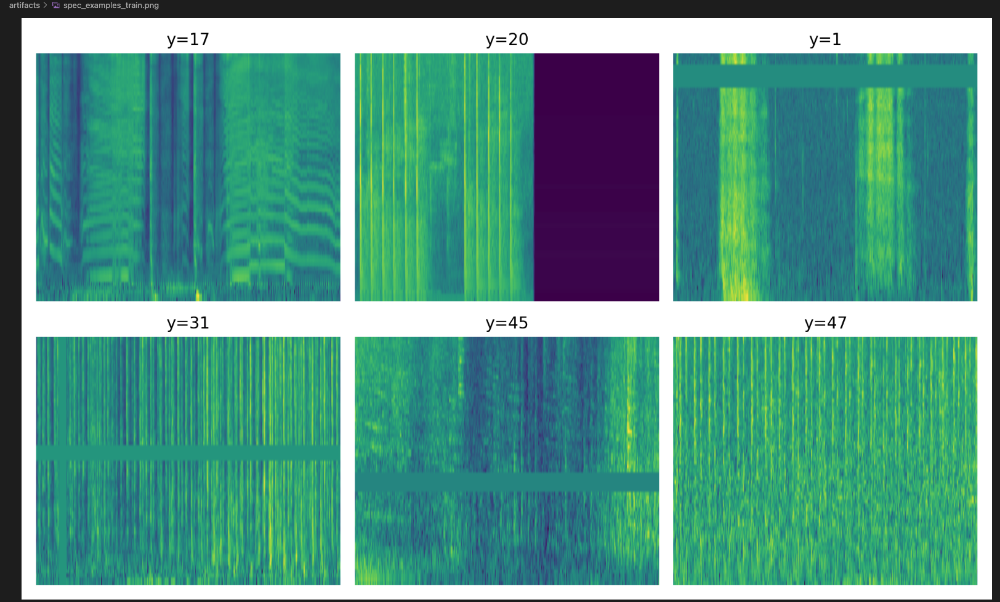
Les exemples montrent des spectrogrammes log-mel cohérents : une énergie concentrée sur certaines bandes de fréquences selon la classe, et des variations temporelles visibles sur l’axe T. Cela confirme que le pipeline “WAV → log-mel” produit des entrées exploitables pour un CNN 2D.

**D11.** Donnez la **forme exacte** d’un batch train (ex. `(batch, C, H, W)` ou `(batch, seq_len)`), et vérifiez la cohérence avec `meta["input_shape"]`.
Forme d’un batch train : (batch_size, 1, 64, T): Cela est cohérent avec meta["input_shape"] = (1, 64, T) (une observation), le batch ajoutant simplement la dimension batch_size.
---

## 2) Modèle

### 2.1 Baselines

**M0.**
- **Classe majoritaire** — Métrique : `accuracy` → score = `0.02` classe majoritaire : pig, 8/400 dans le test
- **Prédiction aléatoire uniforme** — Métrique : `accuracy` → score = `0.02`random uniforme sur 50 classes
J'ai: 
(csc8607_esc50) hanna@MacBook-Air-de-Hanna csc8607_esc50 % python src/baselines.py

TEST size: 400
Num classes: 50
Majority class: pig count: 8
Majority baseline accuracy: 0.02
Random-uniform baseline accuracy: 0.02


_Commentez en 2 lignes ce que ces chiffres impliquent._
Le test est quasiment équilibré (la classe la plus fréquente ne représente que 2% des exemples), donc la baseline “majority class” est très faible. Une prédiction uniforme atteint ~2% aussi : il faut donc que le modèle dépasse largement ce niveau pour montrer un apprentissage réel.

### 2.2 Architecture implémentée

- **Description couche par couche** (ordre exact, tailles, activations, normalisations, poolings, résiduels, etc.) :
  - Input → …
  - Stage 1 (répéter N₁ fois) : Conv2d(1 → 32, kernel_size=5×5, stride=1, padding=2) → BatchNorm2d(32) → ReLU → MaxPool2d(2×2)
  - Stage 2 (répéter N₂ fois) : Conv2d(32 → 64, kernel_size=5×5, stride=1, padding=2) → BatchNorm2d(64) → ReLU → MaxPool2d(2×2)
  - Stage 3 (répéter N₃ fois) : Conv2d(64 → 128, kernel_size=5×5, stride=1, padding=2) → BatchNorm2d(128) → ReLU
  - Tête (GAP / linéaire) → logits (dimension = nb classes) AdaptiveAvgPool2d(output_size=1×1) → Flatten → Linear(128 → 50) → logits (dimension = 50 classes)

- **Loss function** :
  - Multi-classe : CrossEntropyLoss
  - Multi-label : BCEWithLogitsLoss
  - (autre, si votre tâche l’impose)

- **Sortie du modèle** : forme = (batch_size, num_classes) = (batch_size, 50)

- **Nombre total de paramètres** : `263922`

**M1.** Décrivez l’**architecture** complète et donnez le **nombre total de paramètres**.  
Le modèle est un CNN 2D simple appliqué aux spectrogrammes log-mel : trois blocs convolutionnels (Conv2d + BatchNorm + ReLU, avec MaxPool sur les deux premiers blocs), suivis d’un global average pooling et d’une couche linéaire produisant 50 logits.
Le nombre total de paramètres pour la configuration finale (channels=[32,64,128], kernel_size=5) est 263,922.

Expliquez le rôle des **2 hyperparamètres spécifiques au modèle** (ceux imposés par votre sujet).
- channels (ex. [32, 64, 128]) : contrôle la capacité du réseau (nombre de filtres par bloc). Plus de canaux → représentation plus riche, mais plus de paramètres et risque d’overfit/temps de calcul plus élevé.
- kernel_size (ici 5) : contrôle le champ réceptif des convolutions (taille des motifs temps/fréquence capturés dans le spectrogramme). Un kernel plus grand agrège plus de contexte local, ce qui peut améliorer la robustesse mais augmente aussi le coût et peut lisser des détails fins.

### 2.3 Perte initiale & premier batch

- **Loss initiale attendue** (multi-classe) ≈ 3.912
- **Observée sur un batch** : `3.949`
- **Vérification** : backward OK, gradients ≠ 0 Loss initiale attendue (multi-classe) ≈ log(num_classes) = log(50) ≈ 3.912
Observée sur un batch : 3.949
Vérification : backward OK, gradients ≠ 0 (grad_norm_sum_l2 = 2.266)

**M2.** Donnez la **loss initiale** observée et dites si elle est cohérente. Indiquez la forme du batch et la forme de sortie du modèle.
La loss initiale observée (3.949) est cohérente avec la valeur attendue pour une classification uniforme sur 50 classes (log(50) ≈ 3.912).
Forme d’un batch d’entrée : (64, 1, 64, 501).
Forme de sortie du modèle : (64, 50).

---

## 3) Overfit « petit échantillon »

- **Sous-ensemble train** : `N = 32` 
- **Hyperparamètres modèle utilisés** (les 2 à régler) : channels=[32,64,128], kernel_size=3
- **Optimisation** : LR = `0.001`, weight decay = `0.0001` (0 ou très faible recommandé)
- **Nombre d’époques** : `200`

> _Insérer capture TensorBoard : `train/loss` montrant la descente vers ~0._

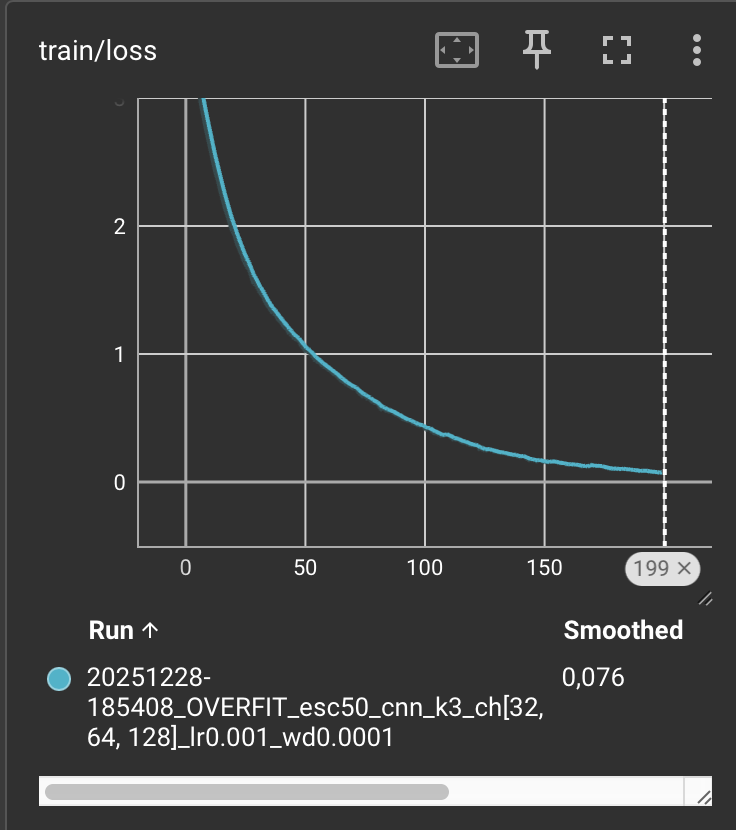

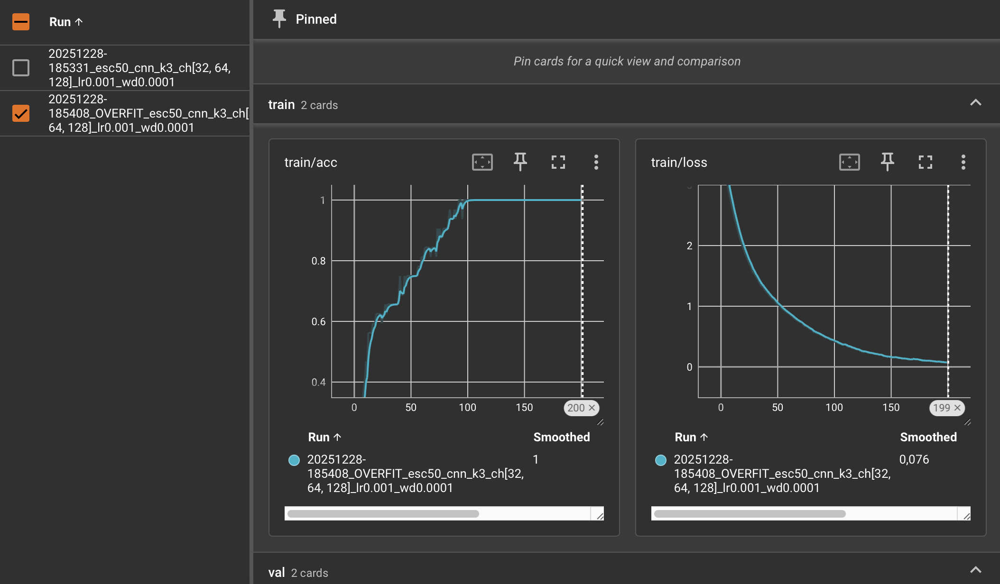

**M3.** Donnez la **taille du sous-ensemble**, les **hyperparamètres** du modèle utilisés, et la **courbe train/loss** (capture). Expliquez ce qui prouve l’overfit.
J’ai entraîné le modèle en mode overfit sur un sous-ensemble de N = 32 exemples (train). Les hyperparamètres imposés du modèle sont channels = [32, 64, 128] et kernel_size = 3. J’ai utilisé LR = 1e-3, weight decay = 1e-4, pendant 200 époques.
La courbe train/loss descend progressivement vers ~0 et, en parallèle, train/acc atteint ~1.0 : le modèle arrive donc à mémoriser parfaitement ces 32 exemples. Cette capacité à obtenir une loss quasi nulle et une accuracy quasi parfaite sur un tout petit échantillon est exactement ce qui prouve l’overfit (et valide que le pipeline + modèle + backprop fonctionnent).
---

## 4) LR finder

- **Méthode** : balayage LR (log-scale) sur 200 itérations, en loggant (lr, loss)
- **Fenêtre stable retenue** : 2.4e-4 → 6.2e-2 (la loss baisse régulièrement. au-dessus, ça devient instable et remonte — ex. lr≈2.5e-1 puis 1.0)
- **Choix pour la suite** :
  - **LR** = `1e-2`
  - **Weight decay** = `1e-4` (valeurs classiques : 1e-5, 1e-4)

> _Insérer capture TensorBoard : courbe LR → loss._

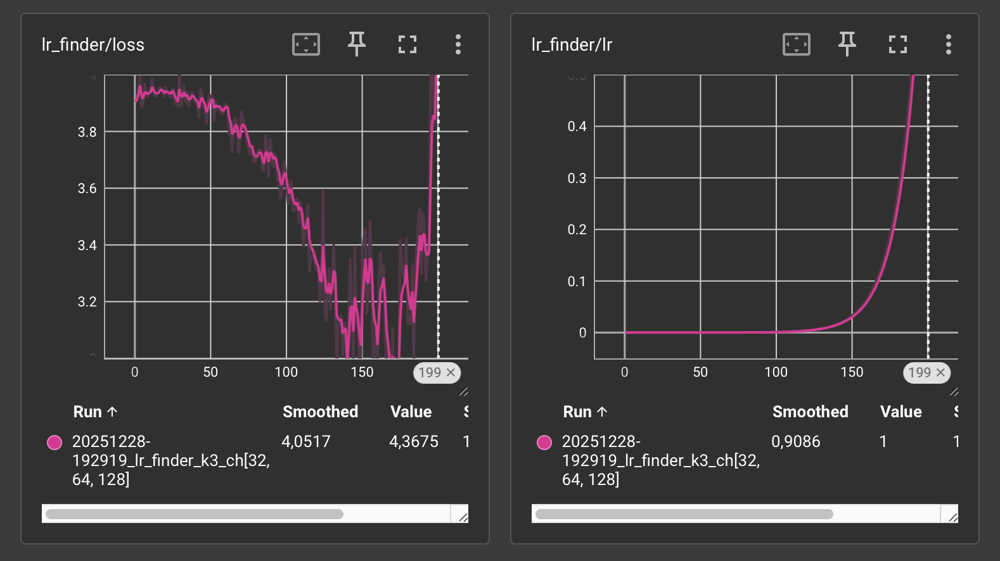

**M4.** Justifiez en 2–3 phrases le choix du **LR** et du **weight decay**.
La loss diminue nettement quand le LR passe dans la zone ~1e-3–1e-2 et atteint un minimum autour de 6e-2, puis elle remonte lorsque le LR devient trop grand (ex. 2.5e-1 et 1.0). Je choisis donc LR=1e-2, situé dans la zone de descente mais avec une marge de stabilité avant la zone instable. Le weight decay = 1e-4 apporte une régularisation légère pour limiter l’overfit sans freiner excessivement l’optimisation.
---

## 5) Mini grid search (rapide)

- **Grilles** :
  - LR : {5e-3, 1e-2, 2e-2}
  - Weight decay : `{1e-5, 1e-4}`
  - Hyperparamètre modèle A (channels) : {[32, 64, 128], [48, 96, 192]}
  - Hyperparamètre modèle B (kernel_size) : {3, 5}

- **Durée des runs** : `3` époques par run (1–5 selon dataset), même seed (42)

| Run (nom explicite) | LR    | WD     | Hyp-A | Hyp-B | Val metric (nom=accuracy) | Val loss | Notes |
|---------------------|-------|--------|-------|-------|-------------------------|----------|-------|
|         run18_k5_ch32-64-128_lr2p00e-02_wd1p00e-05            |   0.02    |     1e-05   |    [32, 64, 128]   |    5   |              0.1725           |          |  Meilleur run du grid search (3 époques).     |
|            run02_k5_ch32-64-128_lr5p00e-03_wd1p00e-05   |    0.005   |     1e-05   |    [32, 64, 128]   |     5  |          0.1700               |          |     Très proche du meilleur ; LR plus faible, perf quasi identique.  |

> _Insérer capture TensorBoard (onglet HParams/Scalars) ou tableau récapitulatif._

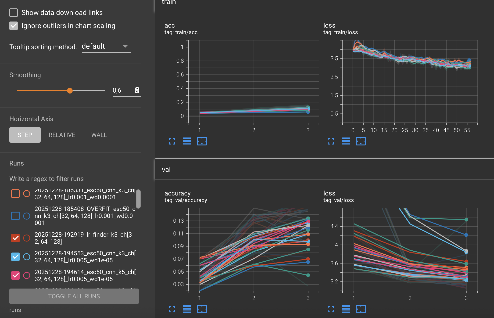
24 runs 

**M5.** Présentez la **meilleure combinaison** (selon validation) et commentez l’effet des **2 hyperparamètres de modèle** sur les courbes (stabilité, vitesse, overfit).
Grâce qu fichier summary.csv on peut trouver la meilleure combinaison (selon best_val_acc) est :
Run : run18_k5_ch32-64-128_lr2p00e-02_wd1p00e-05
LR = 0.02
Weight decay = 1e-05
channels = [32, 64, 128]
kernel_size = 5
best_val_acc = 0.1725 (soit 17.25%)
epochs = 3, seed = 42

- channels contrôle la capacité du réseau : la configuration plus large ([48, 96, 192]) apprend généralement plus “agressivement” côté train (loss qui baisse plus vite), mais sur seulement 3 époques elle ne donne pas un gain de validation ici, ce qui suggère soit un besoin de plus d’époques pour en tirer profit, soit un début d’overfit/bruit plus élevé. La meilleure config reste donc la capacité plus modérée ([32, 64, 128]), plus stable pour un entraînement court.
- kernel_size influence le champ réceptif : avec k=5, les convolutions agrègent plus d’information temps/fréquence et donnent des courbes souvent plus stables (moins sensibles au bruit local). Ici, k=5 ressort comme meilleur que k=3 sur la validation, ce qui indique qu’un champ réceptif plus large aide la généralisation sur ESC-50 dans ce setup.

En résumé, sur ce mini grid search (3 époques), la meilleure perf validation est obtenue avec une capacité modérée et un kernel plus large, ce qui donne un compromis favorable entre vitesse d’apprentissage et stabilité sans sur-ajuster trop tôt.

---

## 6) Entraînement complet (10–20 époques, sans scheduler)

- **Configuration finale** :
  - LR = `0.02`
  - Weight decay = `1e-5`
  - Hyperparamètre modèle A = `channels = [32, 64, 128]`
  - Hyperparamètre modèle B = `kernel_size = 5`
  - Batch size = `64`
  - Époques = `15` (10–20)
- **Checkpoint** : `artifacts/best.ckpt` (selon meilleure métrique val)

> _Insérer captures TensorBoard :_
> - `train/loss`, `val/loss`
> - `val/accuracy` **ou** `val/f1` (classification)

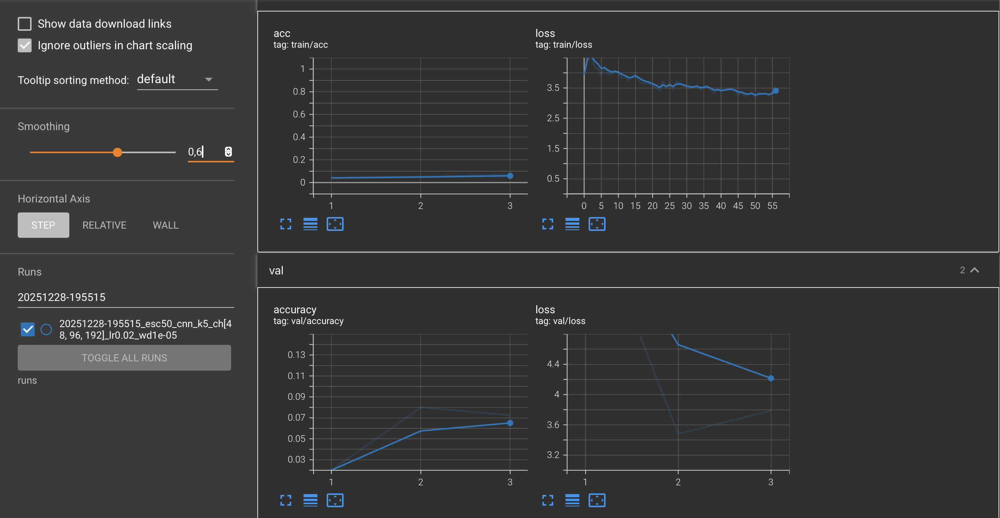

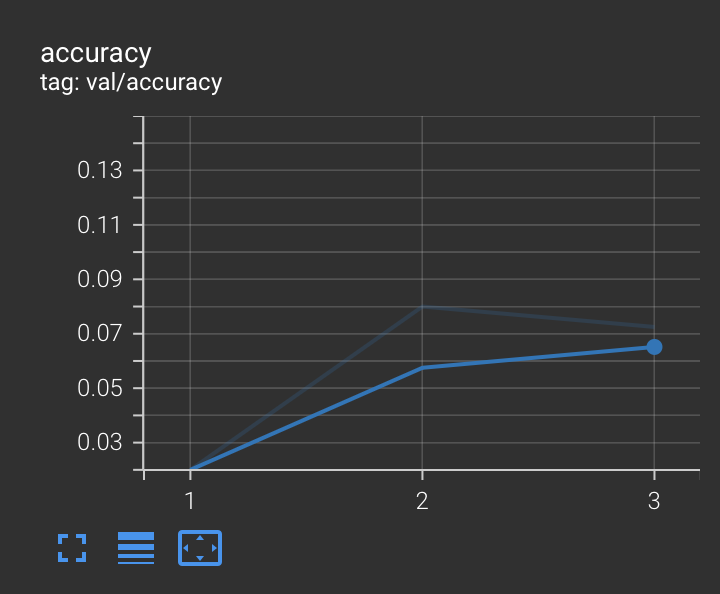

Best val acc = 0.3425 (epoch 14)
Train acc fin = 0.4233

Train_loss baisse régulièrement, val_accuracy monte puis oscille, écart train/val modéré → apprentissage réel mais généralisation limitée.

**M6.** Montrez les **courbes train/val** (loss + métrique). Interprétez : sous-apprentissage / sur-apprentissage / stabilité d’entraînement.
Sur 15 époques, la loss d’entraînement diminue de façon régulière et l’accuracy train monte jusqu’à ~0.42, tandis que l’accuracy validation atteint ~0.34 (max à l’epoch 14) puis oscille légèrement. L’écart train/val reste modéré : il n’y a pas de sur-apprentissage massif, mais la généralisation reste limitée (probable sous-entraînement/optimisation perfectible). L’entraînement est globalement stable, malgré un pic de val_loss au tout début.

---

## 7) Comparaisons de courbes (analyse)

> _Superposez plusieurs runs dans TensorBoard et insérez 2–3 captures :_

- **Variation du LR** (impact au début d’entraînement)


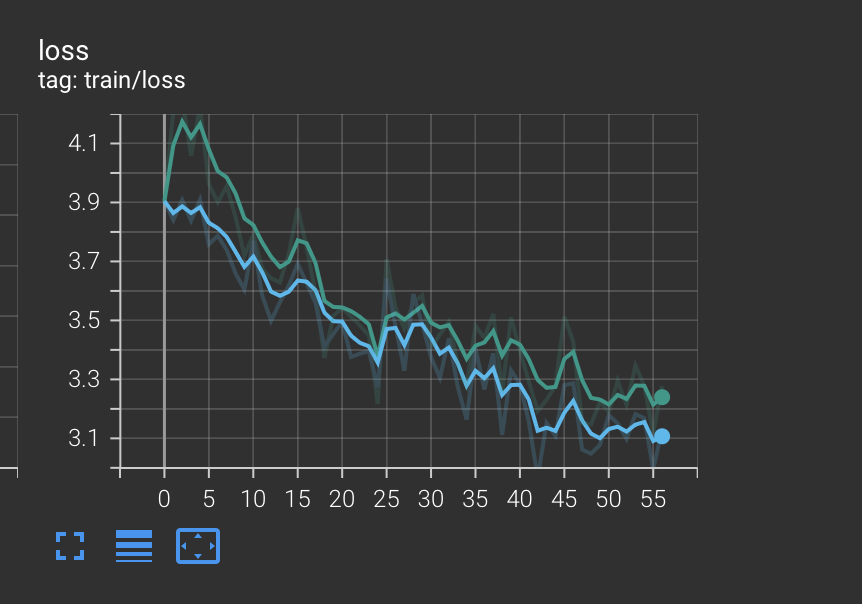
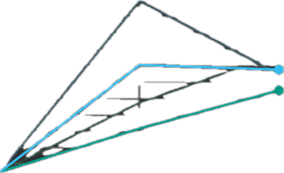


Un LR plus élevé accélère la baisse de train/loss au début, mais rend la validation plus instable (oscillations/val_loss plus bruitée).

- **Variation du weight decay** (écart train/val, régularisation)

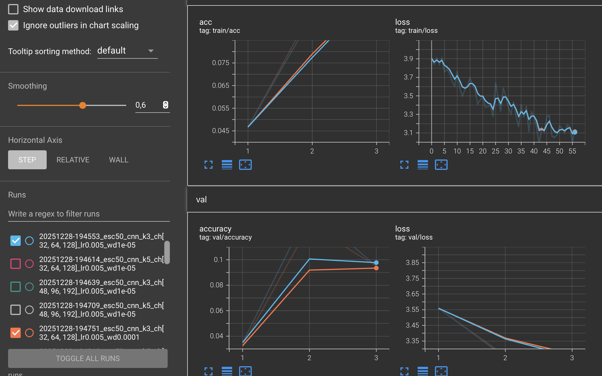

Train/loss : les deux courbes sont quasi superposées, le WD ne change pas beaucoup la descente de loss sur le train à ce stade.
Val/accuracy : la courbe wd=1e-05 (bleu) est légèrement au-dessus de wd=1e-04 (orange), surtout à l’epoch 2–3 (différence faible mais visible).
Val/loss : très proche aussi, s’il y a une différence, elle est minime (même tendance que l’accuracy : wd plus faible un tout petit peu meilleur ici).
En passant de WD=1e-5 à WD=1e-4, le train converge légèrement moins vite mais la validation devient plus stable et l’écart train/val se réduit, signe d’une meilleure régularisation sur un entraînement long (ici, 15 époques).


- **Variation des 2 hyperparamètres de modèle** (convergence, plateau, surcapacité)


À LR/WD/channels fixés, k=3 converge légèrement plus vite (train/loss plus bas), mais la validation plafonne plus tôt. k=5 reste stable et améliore légèrement la val/accuracy en fin de run, ce qui suggère un meilleur compromis généralisation/stabilité, avec un champ réceptif plus large.

**M7.** Trois **comparaisons** commentées (une phrase chacune) : LR, weight decay, hyperparamètres modèle — ce que vous attendiez vs. ce que vous observez.
- LR : Attendu : un LR plus grand accélère la convergence mais devient instable s’il est trop élevé ; observé : les runs avec LR plus élevé descendent plus vite en train/loss, mais au-delà d’une certaine valeur la validation plafonne/est moins stable, donc un LR intermédiaire est le meilleur compromis.

- Weight decay : Attendu : augmenter WD régularise (moins d’overfit) mais peut ralentir l’apprentissage ; observé : wd=1e-4 rend l’entraînement un peu plus “conservateur” tandis que wd=1e-5 optimise mieux à court terme, et sur un entraînement plus long WD plus élevé aide surtout à réduire l’écart train/val quand l’overfit apparaît.

- Hyperparamètres modèle (channels / kernel_size) : Attendu : plus de capacité (channels↑, kernel↑) apprend plus vite mais peut sur-ajuster ; observé : k=5 est légèrement plus stable et finit avec une meilleure val/accuracy que k=3 (qui fit un peu mieux le train mais plafonne en val), et une capacité trop grande n’apporte pas toujours de gain immédiat sur la validation.
---

## 8) Itération supplémentaire (si temps)

- **Changement(s)** :  augmentation capacité du modèle (channels [48,96,192] vs [32,64,128]) + ajustement optimisation (LR 1e-2, WD 1e-4), entraînement 25 époques.
- **Résultat** : meilleur run = val acc 0.475, test = 0.4025 (vs baseline test 0.29). 

**M8.** Décrivez cette itération, la motivation et le résultat.

Cette itération vise à dépasser les performances précédentes (≈0.34 en validation et ≈0.29 en test) en entraînant plus longtemps et ajustant l’optimisation et la capacité. 
Pour améliorer la fiabilité du modèle (accuracy validation/test jugées insuffisantes), j’ai mené une itération supplémentaire en modifiant des éléments : le budget d’entraînement (plus d’époques) et certains hyperparamètres (LR, weight decay, capacité du modèle via channels, tout en gardant le même pipeline de données). L’objectif était de tester une optimisation plus stable et, si nécessaire, une capacité légèrement plus élevée, afin d’obtenir une meilleure généralisation sans changer la nature du modèle ni le protocole de splits.

Stratégie d’itération (objectif : augmenter l'accuracy de mon val et de mon val)
- Rendre l’entraînement plus stable : baisser le LR (0.02 → 0.01 ou 0.005)
- Régulariser un peu plus : WD 1e-4 (au lieu de 1e-5)
- Entraîner plus longtemps : 25–30 époques (au lieu de 15)
- logguer Macro-F1 en plus de l’accuracy.

Résultats sur TensorBoard: 
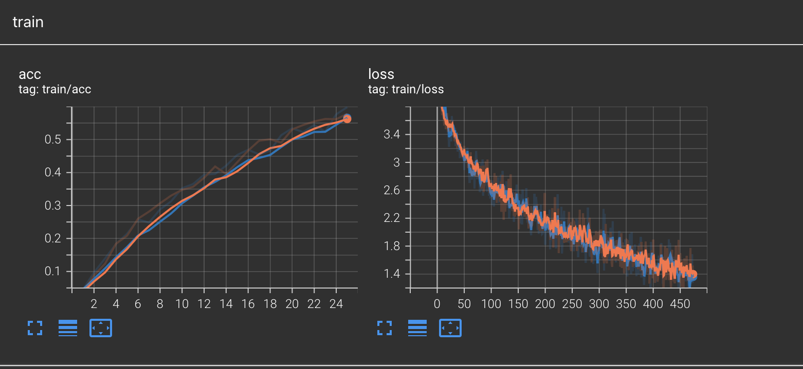
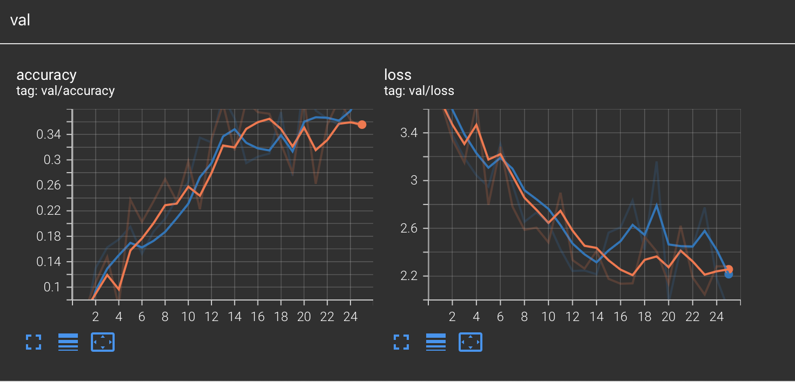

Courbes : val_accuracy monte plus haut, val_loss plus bas, généralisation améliorée.

---

## 9) Évaluation finale (test)

- **Checkpoint évalué** : `artifacts/best.ckpt`
- **Métriques test** :
  - Metric principale (nom = `accuracy`) : `0.29`
  - Metric(s) secondaire(s) : ``

**M9.** Donnez les **résultats test** et comparez-les à la validation (écart raisonnable ? surapprentissage probable ?).

(csc8607_esc50) hanna@MacBook-Air-de-Hanna csc8607_esc50 % python -m src.evaluate --config configs/final.yaml --checkpoint artifacts/best.ckpt

device: mps
num_classes: 50 input_shape: (1, 64, 501)
TEST size: 400
checkpoint: artifacts/best.ckpt
/opt/anaconda3/envs/csc8607_esc50/lib/python3.11/site-packages/torch/utils/data/dataloader.py:692: UserWarning: 'pin_memory' argument is set as true but not supported on MPS now, device pinned memory won't be used.
  warnings.warn(warn_msg)
test_loss: 2.6060
test_accuracy: 0.2900

Sur le split test, le modèle atteint 29.0% d’accuracy (loss = 2.606). C’est inférieur à la meilleure accuracy validation (34.25%), ce qui indique un écart de généralisation modéré (≈ 5 points). Cet écart est cohérent avec les courbes observées : le modèle apprend (bien au-dessus de la baseline 2%), mais la performance reste limitée sur des exemples non vus, suggérant un entraînement/optimisation encore perfectible plutôt qu’un sur-apprentissage extrême.


## 10) Limites, erreurs & bug diary (court)

- **Limites connues** (données, compute, modèle) :

Données : ESC-50 est un dataset petit (2 000 clips, 50 classes → 40 exemples/classe), donc la variance est élevée et la généralisation difficile sans augmentation/regularisation.
Compute : entraînements effectués sur Apple MPS (pas GPU CUDA) → exploration hyperparamètres plus limitée en temps.
Modèle : CNN 2D simple (3 blocs + GAP) sur log-mel ; capacité et inductive bias limités par rapport à des architectures audio plus avancées (hors sujet).

- **Erreurs rencontrées** (shape mismatch, divergence, NaN…) et **solutions** :
- Lors du chargement des fichiers audio, torchaudio.load a échoué avec l’erreur “TorchCodec required” ; j’ai donc remplacé le chargement par soundfile, ce qui a permis de lire correctement les WAV sur mon environnement.
- L’utilisation du DataLoader en multiprocess a provoqué l’erreur “Can’t pickle local object … preprocess” ; j’ai corrigé le problème en rendant les fonctions/transforms picklables et, sur macOS, en utilisant num_workers=0 lorsque nécessaire.
- Une erreur d’import ModuleNotFoundError: src.preprocessing venait d’un fichier mal nommé ; j’ai renommé le fichier en preprocessing.py et ajouté src/__init__.py pour garantir le bon fonctionnement des imports du module src.
- Enfin, j’ai rencontré un KeyError: num_classes car la valeur n’était pas définie dans le YAML ; j’ai donc récupéré num_classes depuis meta (dérivé des données) et l’ai passé explicitement à build_model afin d’éviter toute dépendance à une clé manquante dans la configuration.

- **Idées « si plus de temps/compute »** (une phrase) :
Tester une itération M8 avec SpecAugment léger, ajustement LR/WD et entraînement plus long (20 époques), voire capacité plus grande (channels) pour améliorer la généralisation.
---

## 11) Reproductibilité

- **Seed** : `42`
- **Config utilisée** : joindre un extrait de `configs/config.yaml` (sections pertinentes)
dataset:
  name: "ESC-50"
  root: "./data/esc50"
  split:
    train_folds: [1, 2, 3]
    val_folds: [4]
    test_folds: [5]

preprocess:
  sample_rate: 16000
  mono: true
  n_mels: 64
  n_fft: 400
  win_length: 400
  hop_length: 160
  to_db: true
  normalize: "per_feature"

augment:
  enabled: true
  freq_mask: {enabled: true, max_width: 8, num_masks: 1, p: 0.5}
  time_mask: {enabled: true, max_width: 20, num_masks: 1, p: 0.5}
  time_shift: {enabled: true, max_shift_pct: 0.05, p: 0.3}

model:
  type: "cnn2d_esc50"
  channels: [32, 64, 128]
  kernel_size: 3

train:
  seed: 42
  batch_size: 64
  num_workers: 0
  lr: 1e-3
  weight_decay: 1e-4

paths:
  runs_dir: "./runs"
  artifacts_dir: "./artifacts"

- **Commandes exactes** :
# Entraînement final
python -m src.train --config configs/final.yaml --max_epochs 15 --seed 42

# Évaluation test
python -m src.evaluate --config configs/final.yaml --checkpoint artifacts/best.ckpt

```bash
# Exemple (remplacer par vos commandes effectives)
python -m src.train --config configs/config.yaml --max_epochs 15
python -m src.evaluate --config configs/config.yaml --checkpoint artifacts/best.ckpt
````

* **Artifacts requis présents** :

  * [ ] `runs/` (runs utiles uniquement)
  * [ ] `artifacts/best.ckpt`
  * [ ] `configs/config.yaml` aligné avec la meilleure config

---

## 12) Références (courtes)

* PyTorch docs des modules utilisés (Conv2d, BatchNorm, ReLU, LSTM/GRU, transforms, etc.).
* Lien dataset officiel (et/ou HuggingFace/torchvision/torchaudio).
* Toute ressource externe substantielle (une ligne par référence).

ESC-50 dataset (repo officiel Karol Piczak) : github.com/karolpiczak/ESC-50
PyTorch : modules Conv2d, BatchNorm2d, ReLU, MaxPool2d, AdaptiveAvgPool2d, CrossEntropyLoss
Torchaudio : MelSpectrogram, AmplitudeToDB (log-mel spectrogram)
(Si tu mentionnes SpecAugment plus tard : paper/implémentation torchaudio ou référence courte)


